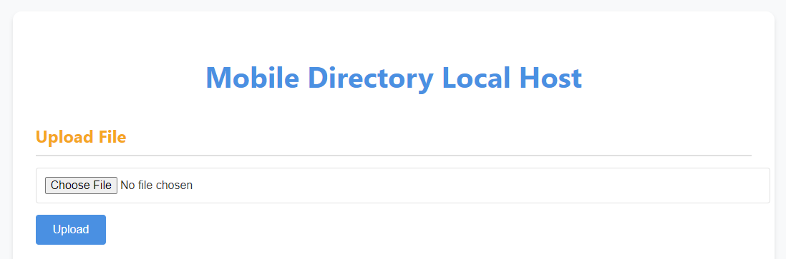
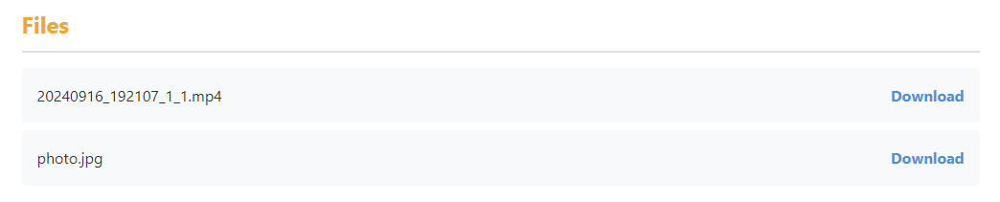
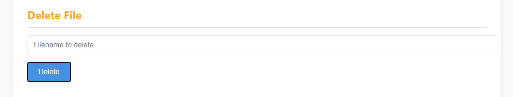
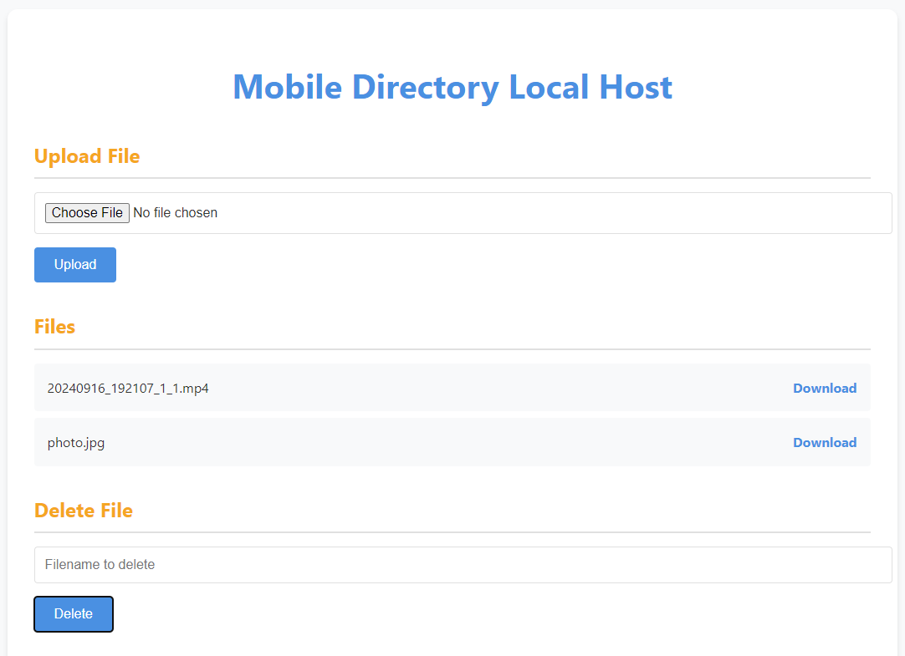
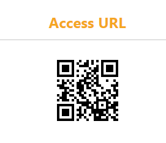

# Mobile Directory Local Host with Express on UserLAnd

## Overview

This project Mobile Directory Local Host is built with Express.js, designed to run in UserLAnd on an Android device. It allows users to upload, download, and delete files from a specified directory on the device. The application also provides a web interface accessible via a QR code for easy access on the same Wi-Fi network.
A Comprehensive Setup guide is provided in the blog https://medium.com/@rishikesh0523/comprehensive-installation-and-setup-guide-for-lan-based-file-sharing-app-c1796ab102df.

## Features

- **Upload Files:** Upload files to a specified directory on the device.
- **Download Files:** Download files from the directory.
- **Delete Files:** Remove files from the directory.
- **Web Interface:** User-friendly web interface for file management.
- **QR Code:** QR code for easy access to the web interface.

## Screenshots

- **Upload Files:**


- **Download Files:** 



- **Delete Files:** 



- **Web Interface:** 



- **QR Code:** 



## Prerequisites

- **UserLAnd:** Install UserLAnd on your Android device.
- **Node.js:** Ensure Node.js is installed in UserLAnd.
- **Git:** (Optional) Install Git for version control.

## Installation

### 1. Set Up UserLAnd

1. Install UserLAnd from the Google Play Store or F-Droid.
2. Set up a Linux distribution (e.g., Ubuntu) within UserLAnd.

### 2. Install Dependencies

1. **Open UserLAnd Terminal** and update package lists:
   ```bash
   sudo apt update
   ```

2. **Install Node.js and npm:**
   ```bash
   sudo apt install nodejs npm
   ```

3. **Install Git (optional):**
   ```bash
   sudo apt install git
   ```

4. **Clone the Project Repository:**
   ```bash
   git clone https://github.com/Rishikesh0523/mobile-directory-host-lan.git
   cd mobile-directory-host-lan
   ```

5. **Install Project Dependencies:**
   ```bash
   npm install
   ```

## Configuration

1. **Set the Directory Path:**
   Ensure the `downloadsDir` variable in `server.js` points to the correct path for your Downloads folder:
   ```javascript
   const downloadsDir = path.join(process.env.HOME, 'storage', 'downloads');
   ```

2. **Start the Server:**
   ```bash
   node server.js
   ```

3. **Access the Web Interface:**
   - Open a web browser and navigate to `http://<your_local_IP>:3000/`.
   - Use the QR code provided in the web interface to access it from other devices on the same Wi-Fi network.

## Usage

- **Upload a File:** Use the "Upload File" form on the web interface to upload files to the server.
- **Download a File:** Click the "Download" link next to the file name in the file list.
- **Delete a File:** Enter the filename in the "Delete File" form and submit to remove the file.

## Troubleshooting

- **File Not Found Error:** Ensure the file path is correct and the file exists in the specified directory.
- **Permission Issues:** Make sure UserLAnd has the necessary permissions to access and modify files in the Downloads directory.

## Contact

For any questions or issues, please open an issue on the GitHub repository or contact [rishikesh0523@gmail.com](mailto:rishikesh0523@gmail.com).
